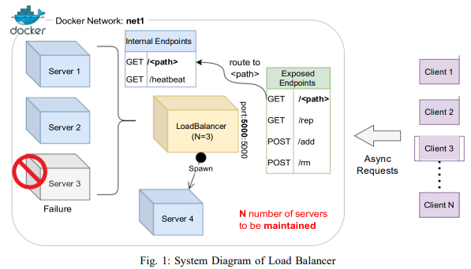

# Implementing a Customizable Load Balancer

## Overview


## Prerequisites

- [Python 3.8](https://www.python.org/downloads/release/python-380/) : Programming language.
- [Docker Desktop](https://www.docker.com/products/docker-desktop) : Running the application in a container.
- [Postman](https://www.postman.com/downloads/) : Testing the HTTP API endpoints.

## Installation
- Create a virtual environment:

```sh
 python -m venv venv
```

- Activate the virtual environment:
- For Linux or macOS:
```sh
 source venv/bin/activate
```
- For Windows
```sh
 venv\Scripts\activate
```

## Usage

- Running the application for the first time:

```sh
 docker-compose up --build
```

- Running the application:

```sh
 docker-compose up
```

- Stopping the application:

```sh
 docker-compose down
```

- For more details on how to run:

  - [The Server](./server/README.md)
  - [The Load Balancer](./load_balancer/README.md)

## Analysis

## i) A-1

-  Launch 10000 async requests on N = 3 server containers and report the request count handled by each server instance
in a bar chart. Explain your observations in the graph and your view on the performance.

### Observations

## ii) A-2

-  Next, increment N from 2 to 6 and launch 10000 requests on each such increment. Report the average load of the servers 
at each run in a line chart. Explain your observations in the graph and your view on the scalability of the load balancer
implementation.

### Observations

## iii) A-3

-  Test all endpoints of the load balancer and show that in case of server failure, the load balancer spawns a new instance
quickly to handle the load.

### Observations

## iv) A-4

-  Finally, modify the hash functions H(i), Φ(i, j) and report the observations from (A-1) and (A-2).

### Observations
